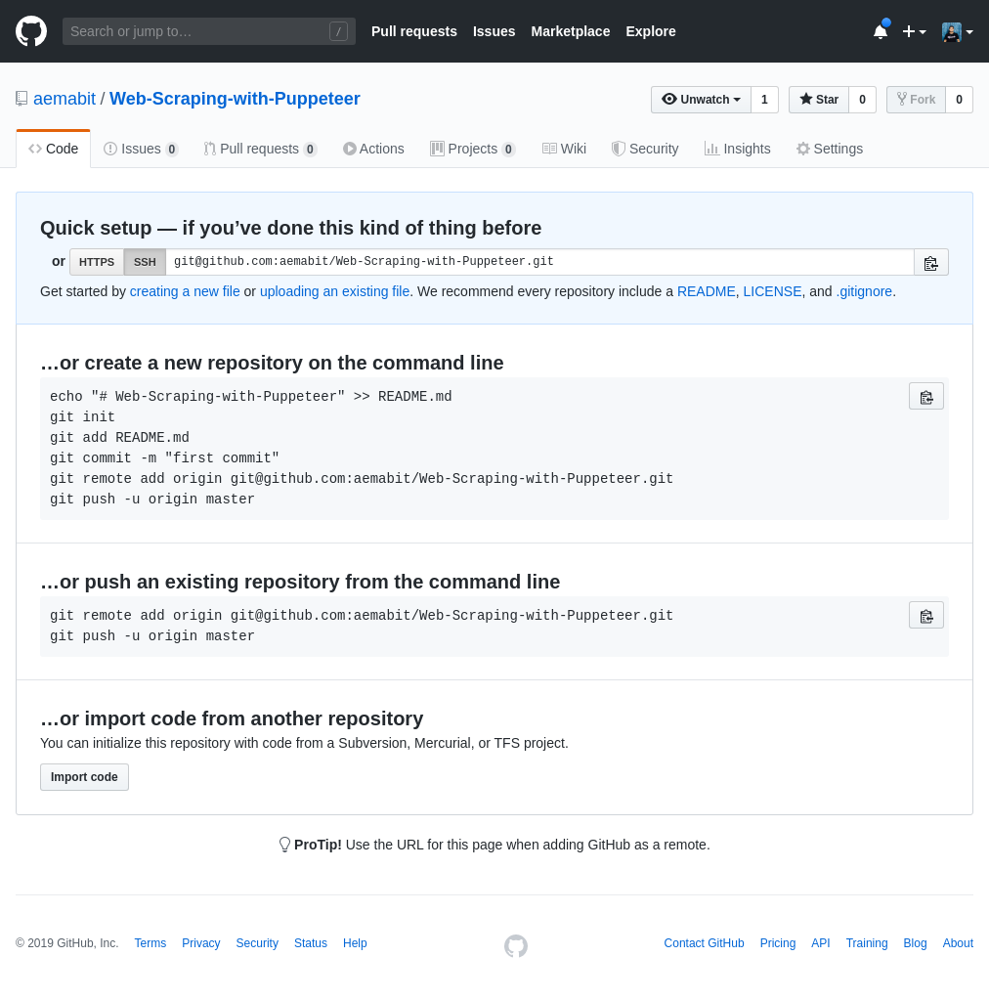

# WEB SCRAPING WITH PUPPETEER

## Description
Create a new repository with Node.js and Puppeteer

## Objetives
* Login in Github using PUPPETEER.
* Generate a new Github repository.
* Take a screenshoot and save in a folder.
* Return in console the new Github repository address.
